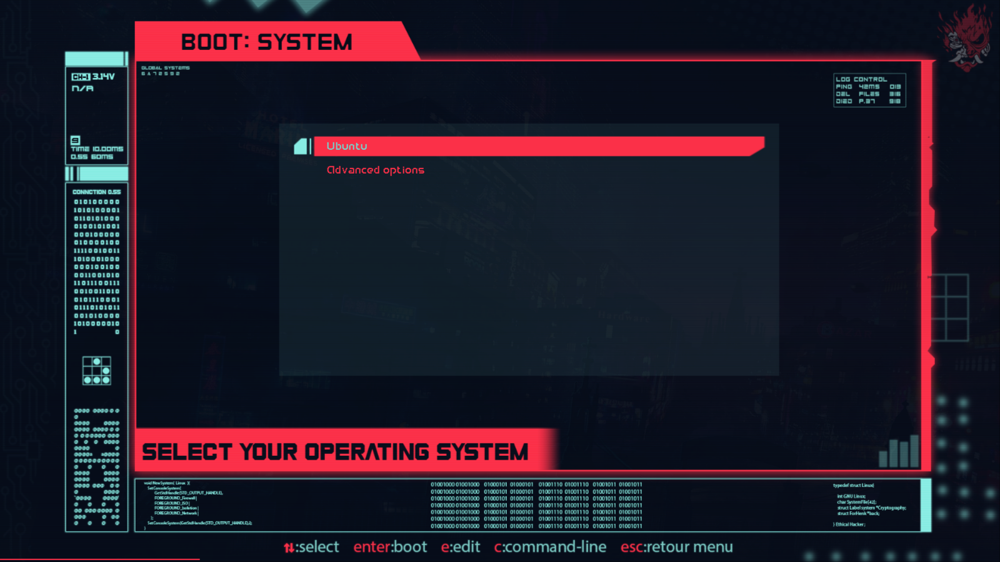
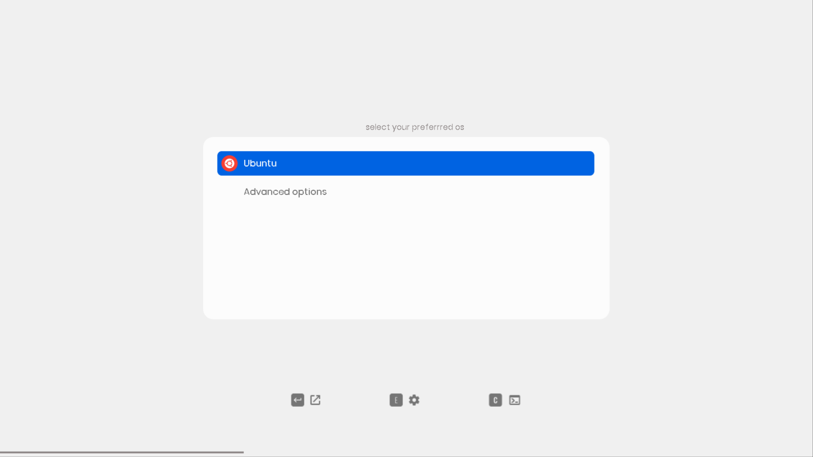
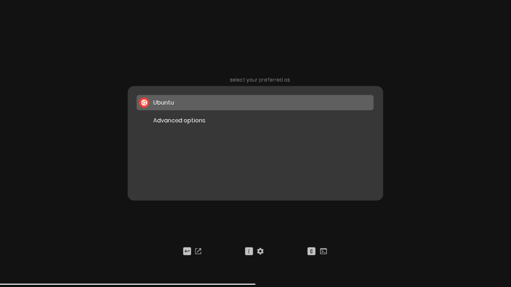
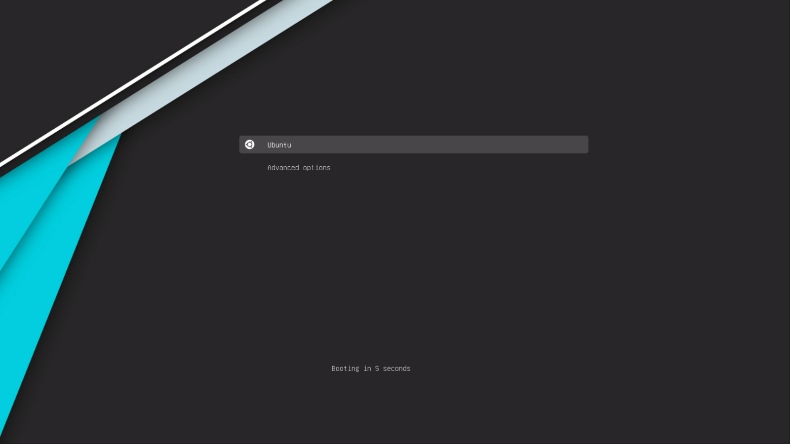

# Ubuntu Spinner

Rookie’s Script to quickly setup Ubuntu with Dual-Boot, IDEs, Trackpad Gestures, Media Codecs, Battery Saver and more.

# Getting Started

Just Copy the following commands into your Terminal and hit [ENTER], then follow the on-screen instructions.

```bash
sudo apt update
sudo apt install git -y
git clone https://github.com/thekarananand/UbuntuSpinner.git
cd UbuntuSpinner
chmod +x install.sh
./install.sh
```

To Re-Execute the Script after Reboot

```bash
cd UbuntuSpinner
./install.sh
```

# GRUB Theme



### CyberRe

Source : [https://www.gnome-look.org/p/1420727](https://www.gnome-look.org/p/1420727)


### ROG

Source : https://github.com/thekarananand/ROG_GRUB_Theme



### Sleek-Light

Source : https://github.com/sandesh236/sleek--themes



### Sleek-Dark

`[Default GRUB Theme]`

Source : https://github.com/sandesh236/sleek--themes



### Vimix

Source :  https://github.com/vinceliuice/grub2-themes


# What will this Script do?

### Base-System Setup

- Disables Wayland
- Install Nala
- Pop!_OS ‘s Tiling Windows
- Add APT Repos for VS Code, JetBrains IDEs (Unofficial , Source : https://github.com/JonasGroeger/jetbrains-ppa ), Android-Studio, Grub-Customizer, Flatpak, Mozilla Firefox
- Add APT Preferences to not bring back Snap
- Add APT Preferences to install Firefox from Official Mozilla Repo
- Setup the Fastest Mirrors for APT
- Remove Ubuntu Bloatware Apps
- Install Flatpak and Setup Flathub
- Install & Configure Gnome-Extensions
- Install Base Apps (VLC, preload, htop)
- Install Media Codecs `ubuntu-restricted-extras`

### Laptop Specific Setup (Optional)

- Install & Setup X11-Gestures (for Trackpad Gestures)
- Install & Setup tlp (for Battery Saving)

### Default Apps & IDE (Optional)

- Install VS Code
- Install OnlyOffice Desktop Edition
- Calculus
- Notion ( Unofficial, Source : https://github.com/puneetsl/lotion )

### Optional One Click Install for Apps & IDE

- VS Code
- Android-Studio
- JetBrains PyCharm (Community)
- JetBrains DataSpell
- JetBrains IntelliJ IDEA (Community)
- OnlyOffice Desktop Edition
- Calculus
- Notion ( Unofficial, Source : https://github.com/puneetsl/lotion )
